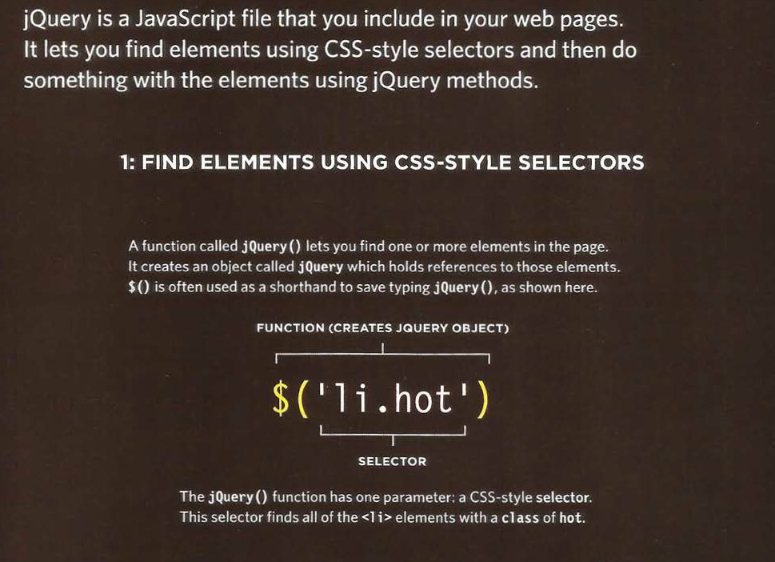
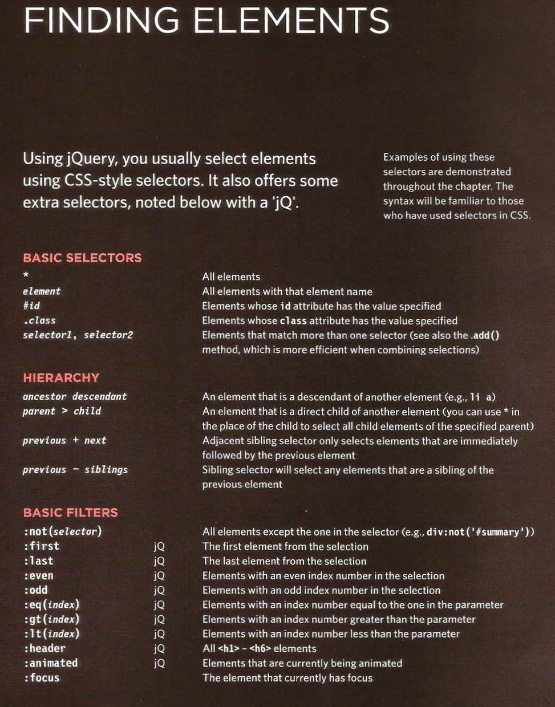

## JavaScript and jQuery book by Jon Duckett



`$('li.hot).addClass('complete);`



## Checking a pages is ready to work with 

```
$(document).ready(function(){
    //your script goes here
});

```

## 6 Reasons for Pair Programming 

* *Greater efficiency*
* *Engaged collaboration*
* *Learning from fellow students*
* *Social skills*
* *Job interview readiness*
* *Work environment readiness*