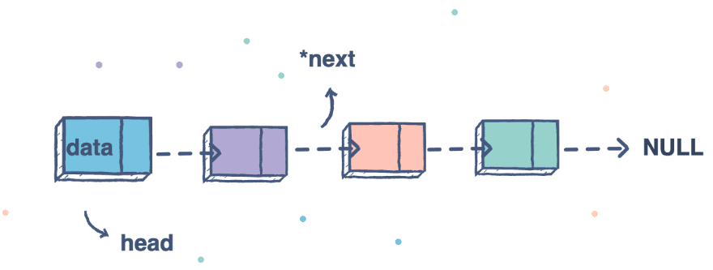
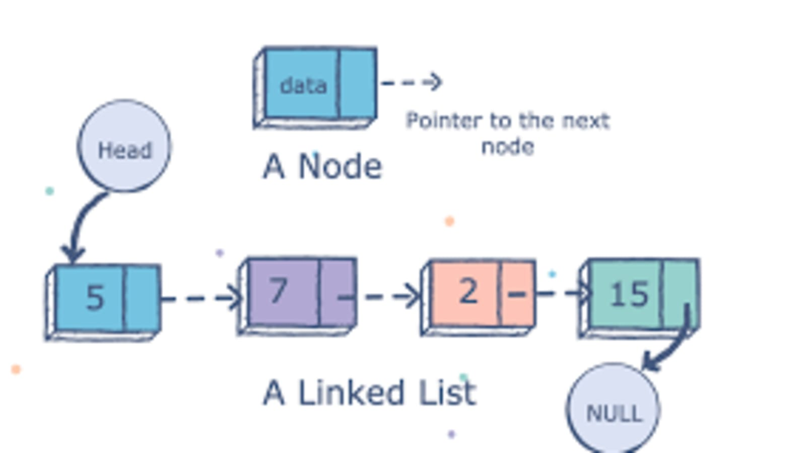

# Linked List

**A Linked List** is a sequence of Nodes that are connected/linked to each other. The most defining feature of a Linked List is that each Node references the next Node in the link.

## ***Type of linked list:***

1. Singly List : a list has one (single) reference direction to the nodes which is NEXT node.

2. Doubly List : a list has two (double) references directions to the nodes, NEXT and Prev node.

3. circular list : a list that has the final node references to the head node.

* Node : refers to single item in the linked list that holds the data.

* Head : refers to the first node in the linked list.

* Current : refers to the node currently being looked at. and when we do some operations to the linked list we define the current as the head node to ensure we start at the beginning.

* Node.next : reference to the next node. And the final element is not node rather its reference to null.

## Traversal

* create a current as a pointer on the Head to guarantee that are starting from the beginning

* create while loop. This loop will still run until the current is pointing on null.

* check if the value of current is equal to the value that looking for.

* If current does not contain a value, make the current as pointer on the next node.

* Once the condition becomes true, the while loop breaks
Once the current hit the end, it means did not find the value, so return false.

## Big O (Time and Space complexity)

* ***Time Complexity:*** How much more runtime do we need as the input of the algorithm increases.

* ***Space Complexity:*** How much more memory (RAM) do we need as the input of the algorithm increases.

### We express time and space complexity using ***Big O Notation***.

