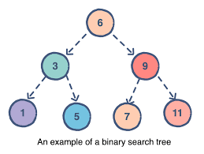

# Trees

##  Binary Trees, Binary Search Trees, and K-ary Trees.

### - ***Common Terminology***

Node - A Tree node is a component which may contain it’s own values, and references to other nodes
Root - The root is the node at the beginning of the tree
K - A number that specifies the maximum number of children any node may have in a k-ary tree. In a binary tree, k = 2.
Left - A reference to one child node, in a binary tree
Right - A reference to the other child node, in a binary tree
Edge - The edge in a tree is the link between a parent and child node
Leaf - A leaf is a node that does not have any children
Height - The height of a tree is the number of edges from the root to the furthest leaf.

### ***Traversals***

Traversing a tree allows us to search for a node, print out the contents of a tree..

* ***categories of traversals:***

- Depth First
- Breadth First

### Depth First

Depth first traversal is where we prioritize going through the depth (height) of the tree first. There are multiple ways to carry out depth first traversal, and each method changes the order in which we search/print the root. Here are three methods for depth first traversal:

- Pre-order: root >> left >> right
- In-order: left >> root >> right
- Post-order: left >> right >> root

The most common way to traverse through a tree is to use recursion. With these traversals, we rely on the call stack to navigate back up the tree when we have reached the end of a sub-path.

* Pre-order means that the root has to be looked at first. In our case, looking at the root just means that we output its value. When we call preOrder for the first time, the root will be added to the call stack

### - ***Breadth first***
Breadth first traversal iterates through the tree by going through each level of the tree node-by-node

### ***Binary Search Trees***
A Binary Search Tree (BST) is a type of tree that does have some structure attached to it. In a BST, nodes are organized in a manner where all values that are smaller than the root are placed to the left, and all values that are larger than the root are placed to the right.

### - ***Searching a BST***
Searching a BST can be done quickly, because all you do is compare the node you are searching for against the root of the tree or sub-tree. If the value is smaller, you only traverse the left side. If the value is larger, you only traverse the right side.

