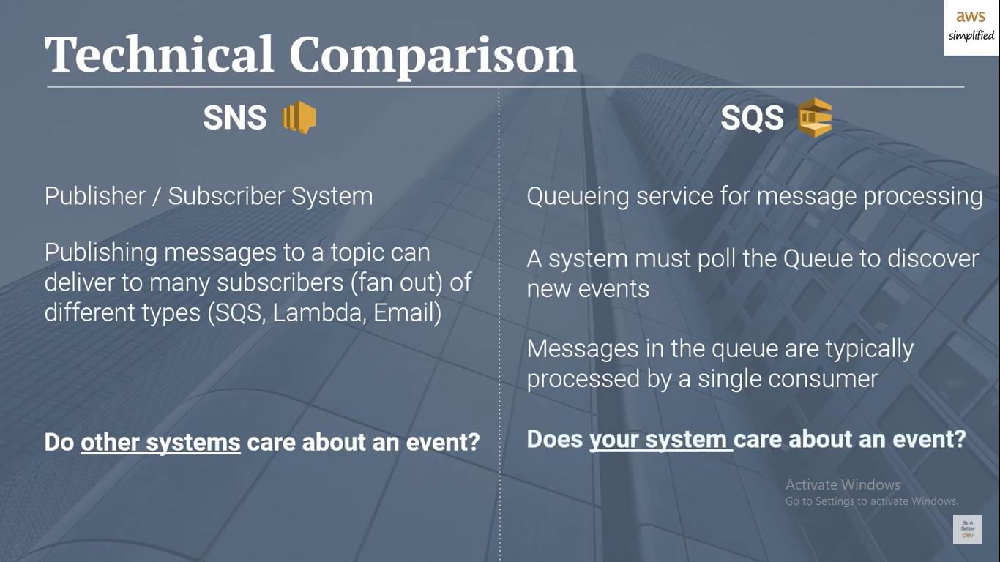

# Event Driven Architecture

* What’s the difference between a FIFO and a standard queue?

FIFO queues have essentially the same features as standard queues, but provide the added benefits of supporting ordering and exactly-once processing. FIFO queues provide additional features that help prevent unintentional duplicates from being sent by message producers or from being received by message consumers. Additionally, message groups allow multiple separate ordered message streams within the same queue.  
[source](https://aws.amazon.com/about-aws/whats-new/2016/11/amazon-sqs-introduces-fifo-queues-with-exactly-once-processing-and-lower-prices-for-standard-queues/)

* How can the server be assured a message was properly received?

By using the message Queue to save the message until the all users/server connected and get the message 

* What classic design pattern is best represented by event driven programming?

The observer pattern is a software design pattern in which an object, named the subject, maintains a list of its dependents, called observers, and notifies them automatically of any state changes, usually by calling one of their methods.

It is mainly used for implementing distributed event handling systems, in "event driven" software. In those systems, the subject is usually named a "stream of events" or "stream source of events", while the observers are called "sinks of events". The stream nomenclature alludes to a physical setup where the observers are physically separated and have no control over the emitted events from the subject/stream-source. This pattern then perfectly suits any process where data arrives from some input that is not available to the CPU at startup, but instead arrives "at random" (HTTP requests, GPIO data, user input from keyboard/mouse/..., distributed databases and blockchains, ...). Most modern programming-languages comprise built-in "event" constructs implementing the observer-pattern components. While not mandatory, most 'observers' implementations would use background threads listening for subject-events and other support mechanisms provided by the kernel (Linux epoll, ...).

[source](https://en.wikipedia.org/wiki/Observer_pattern)

* How do you test an event driven system?

There are multiple levels of tests you will typically write for your system. In the most canonical case, you will write unit tests, service tests, and end-to-end tests.
Service tests, as the name suggests, treat the entire service as the SUT, and increasingly, in microservice architectures this is where the bulk of automated testing occurs. These tests verify the contract of services, that is — given certain inputs, the service produces a certain output. These tests execute in-memory (not a deployed service), prior to deployments and are mostly ‘cheap’ to run. Here is also where we begin to see substantial differences in test implementation between point-to-point and event-driven systems. The reason for these differences is a radically different collaboration style between services and hence — different contracts, that these tests need to cover.
[source](https://medium.com/dan-on-coding/testing-event-driven-systems-63c6b0c57517)

## Term

* FIFO Queue:FIFO (First-In-First-Out) queues are designed to enhance messaging between applications when the order of operations and events is critical, or where duplicates can't be tolerated[source](https://docs.aws.amazon.com/AWSSimpleQueueService/latest/SQSDeveloperGuide/FIFO-queues.html)

* Pub/Sub:(Publish–subscribe pattern)
Publish–subscribe is a sibling of the message queue paradigm, and is typically one part of a larger message-oriented middleware system. Most messaging systems support both the pub/sub and message queue models in their API

[AWS SNS and SQS](https://www.youtube.com/watch?v=mXk0MNjlO7A)